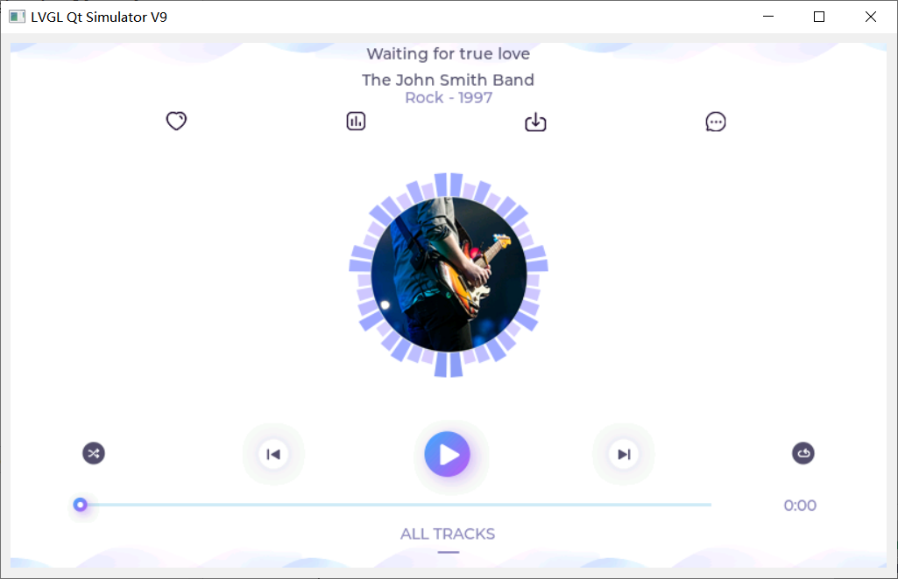

使用QT模拟LVGL9  
Using QT to simulate LVGL9  

### 开发环境   
windows : 10  
QT : 6.9  
LVGL : 9.2  

### 运行  
安装QT6.9，克隆项目：  
```shell
git clone git@github.com:shiyu-sz/lvgl-qt-sim-v9.git  
```
使用QT6.9打开lvgl-qt-sim-v9.pro，编译运行。  

### 效果  
